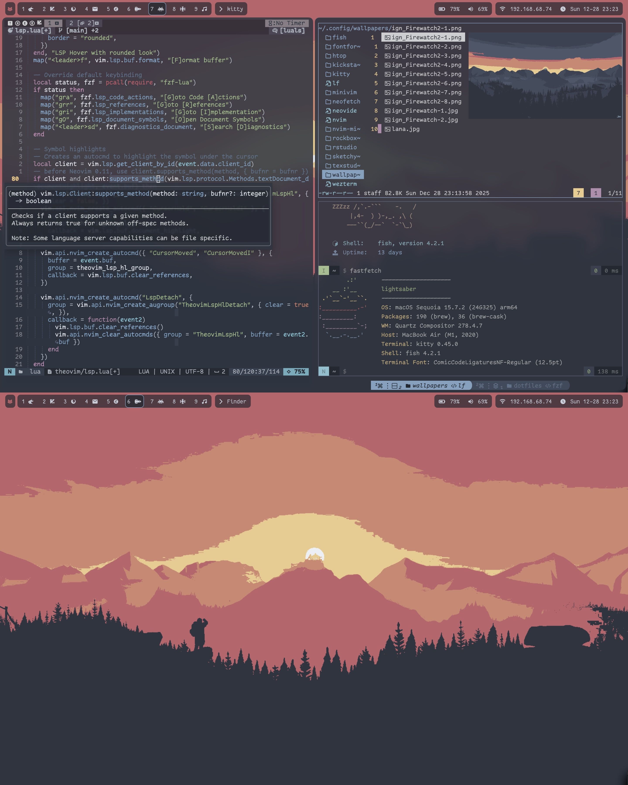

# Theo's dotfiles

> Collection of my configuration files. The reason why this README is so long is definitely not because I like wasting time writing documentation that no one will ever read instead of doing actual work.

|  |
|:--:|
| macOS |

|  |
|:--:|
| Fedora w/ Sway WM |

Here are dotfiles for my systems, M1 MacBook Air and Lenovo ThinkPad X270.
MBA runs the latest version of macOS, and X270 runs the latest version of Fedora Sway Spin with i3 WM installed (Wayland is *almost* there).

You are welcome to take inspiration from any files in this repository, but I do not claim any responsibility for any of the contents of the configurations.
**Read the code before you use it!**

## Installation

- Configure cross-platform utilities using the following commands:
    ```bash
    git clone https://github.com/theopn/dotfiles.git ~/dotfiles
    ~/dotfiles/dotfiles-util.sh --install
    ~/dotfiles/dotfiles-util.sh --delete-backup # Optional
    ```

- Configure macOS-specific utilities and settings using the following commands:
    ```bash
    /bin/bash -c "$(curl -fsSL https://raw.githubusercontent.com/Homebrew/install/HEAD/install.sh)"
    brew analytics off

    ~/dotfiles/dotfiles-util.sh --macos-install
    ```

- Configure i3 WM and related utilities using the following commands:
    ```bash
    ~/dotfiles/dotfiles-util.sh --i3-install
    ```

- Choose configurations in the `misc` directory and manually copy them! Follow the commands in `./misc/README.md`.

### Install My Other Projects

> Shameless plugs

- [Theovim](https://github.com/theopn/theovim) "is my Neovim configuration, geared toward my CS studies (C, Python, Java, LaTeX, LaTeX, and LaTeX).
    It features opinionated base Vim settings and keybindings, ~30 carefully selected plug-ins, and custom UI components written 100% in Lua."
- [Haunted Tiles](https://github.com/theopn/haunted-tiles/) "is my personal i3 WM and Sway setup, along with essential tiling WM tools.
    It used to be a part of my dotfiles repository, and with the growing size of configurations and shared scripts between i3 and Sway, I made a separate repository for it."

### Post-Installation

- Install Doom Emacs:
    ```bash
    git clone --depth 1 https://github.com/doomemacs/doomemacs ~/.emacs.d
    ~/.emacs.d/bin/doom install
    ```

- Add SSH shortcut for frequently used servers:
    ```bash
    ~/dotfiles/dotfiles-util.sh --add-ssh-shortcut
    # Follow the prompt
    ```

- To install fonts using `fontconfig` and the included function in `dotfiles-util.sh`:
    1. Navigate to [NERD Fonts download](https://www.nerdfonts.com/font-downloads) website
    2. Right-click on the font download and copy the link
    3. Execute the following
        ```bash
        $FONT_URL=thing-you-just-copied
        ~/dotfiles/dotfiles-util.sh --install-font $FONT_URL
        ```

- To install CaskayadiaCove and FantasqueSansMono Nerd Fonts using Homebrew:
    ```bash
    brew tap homebrew/cask-fonts &&
    brew install --cask font-caskaydia-cove-nerd-font font-fantasque-sans-mono-nerd-font
    ```

## Shells

### Fish

> Rich built-in features, questionable syntax

It's the de facto default shell that launches when Wezterm opens.
It has a fantastic built-in auto-completion and stupidly fast asynchronous Git status, but I cannot say I prefer the syntax over POSIX contrary to the popular opinion.
Because it's not POSIX compatible, Zsh is my `$SHELL`.

Config: It is very similar to my Zsh setup but takes advantage of better built-in interactive functions

### Zsh

> The shell

- Usage:
    - Prompt:
        ```
        [vi-mode]` ➜ /current/path/ git-branch(* for unstaged, + for staged changes) | last-exit-code ❱
        ```
    - Basic aliases: `cdf` to navigate directories quickly using `fzf`,
        `cl` to `clear`, `l` to `ls` with list view and other options, `histgrep` to look up previous commands
    - `trash`, `trash_cd`, `trash_empty`, `trash_print`: trash related functions.
        The trash directory is located in `~/.theoshell/trash`. This directory will be used again for LF
    - `theoshell_plug <github-username>/<repo-name>`: installs Zsh plug-in from a GitHub repository (to `~/.theoshell/zsh-plugins`) and/or source it
        - I only install [zsh-autocomplete](https://github.com/marlonrichert/zsh-autocomplete) by default
    - `theoshell_upgrade`: Upgrade all Zsh plug-ins in `~/.theoshell/zsh-plugins`

## Terminal Emulators and Multiplxers

### TODO tmux -- Add list of keybindings

> Actual terminal emulator

Keybindings are drastically different from stock bindings so use the `<C-a> ?` key to read the help documentation. Statusbar with various information without using any external plugins.

### Wezterm

> Over-engineered terminal emulator, nailed the fundamental features, and it's configured in Lua!

Wezterm is my primary terminal emulator/multiplexer!
Watch my YouTube video [Configure Wezterm terminal emulator in Lua with me [ASMR Coding]](https://youtu.be/I3ipo8NxsjY) :)

- Usage:
    - `LDR` = `C-a`
    - `LDR c`: Copy mode
    - `LDR -/|`: Create split pane
    - `LDR hjkl`: Navigate pane
    - `LDR q`: Close pane
    - `LDR z`: Zoom pane
    - `LDR r`: `resize_pane` mode. Use `hjkl` to resize pane and `ESC` or `Enter` to confirm
    - `LDR t`: New tab
    - `LDR [/]` Navigate tab
    - `LDR 1-9`: Navigate tab by index
    - `LDR n`: Launch tab navigator
    - `LDR e`: Rename tab title
    - `LDR m`: `move_tab` mode. Use `hj`/`kl` to move tabs and `ESC` or `Enter` to confirm
    - `LDR w`: Workspace launcher
    - `$ wezterm show-keys --lua` to get the Lua table of all keybindings available

## Text Editors (besides Neovim)

### Doom Emacs

> Good OS, mediocre text editor even with Evil mode

Emacs is my to-do list, idea capture, knowledge databases, and tools for other [Second Brain](https://fortelabs.com/blog/basboverview/) functionalities.

- Usage:
    - All the stock Emacs + Evil mode keybindings
    - `C-c a`: Org Agenda
    - `C-c c`: Org Capture
    - `C-c o`: Display Org file outline using `occur`
    - `C-c f`: Find Org-roam node
    - `C-c i`: Insert Org-roam node
    - `C-c r b`: List all Org-roam references in the current buffer
    - `C-c r r`: Sync Org-roam database

### Vim

> Focused note-taker

Because of [my extensive Neovim IDE config](https://github.com/theopn/theovim), My Vimrc is kept minimal as my journal writer with the Vimwiki plug-in.

- Config:
    - Handmade TabLine (buffer line) and StatusLine, sensible default settings, and a handful of plug-ins managed by [vim-plug](https://github.com/junegunn/vim-plug), including [Vimwiki](https://github.com/vimwiki/vimwiki)
    - `pastelcula.vim`, a custom [base16](https://github.com/chriskempson/base16-vim) theme loosely based on Dracula is included.
        Thanks [Jonathan](https://github.com/JonathanOppenheimer) for helping his colorblind friend
    - `:CD`: Change the buffer working directory to the parent directory of the buffer
    - `:TrimWhitespace`: Remove all trailing whitespace
    - Reference the `vimrc` for the list of keybindings

## File Manager

### lf

> My favorite terminal file manager

When I see a CLI file manager with Vim keybindings and minimalistic feature set, I like it. I use it.

- Usage:
    - `~` : Go to the home directory
    - `ee`: Open a file in `$EDITOR`
    - `ec`: You choose what editor you want to open a file in
    - `DD`: Move a file to `~/.theoshell/trash` (it integrates with my Zsh trash functions)
    - `gs`: [g]it [s]tatus
    - `md`: mkdir
    - `mf`: Open a file with the supplied name in Neovim
    - `ml`, `mr`, `ms`: [m]ark [l]oad, [m]ark [r]emove, [m]ark [s]ave
    - `mo`: chmod
    - `sh`: Launch `$SHELL` at the current directory

## Other Tools

### Git

> Thanks Linus

No comments.

### TODO Qutebrowser

> Modern keyboard-based browser

It's based on the Chromium engine, uses Vim keybindings, and is configured through Python. What more can I ask?

## Miscellaneous Configurations

These are single-file, minimal configurations that do not change very often.
These are meant to be manually deployed as needed.
Use the commands in `./misc/README.md` to deploy these configurations.

- `bashrc`: I prioritize simplicity and performance since zsh and Fish take care of my interactive uses and most of my scripts are written in Bash.
    Thus, my `.bashrc` is kept minimal with a simple prompt, some aliases, and variables
- `kitty.conf`: Kitty is my secondary terminal emulator. The configuration is kept minimal since I always pair it up with Tmux
- `ideavimrc`: Sorry to disappoint you, but I code in Java sometimes
- `neofetch.conf`: It includes a prompt inspired by "insert name" from [Neofetch Themes](https://github.com/Chick2D/neofetch-themes)

## macOS Tiling WM Setup -- Yabai, Skhd, Sketchybar

I use these three tools to make a Tokyo-Night-themed tiling WM setup for my macOS environment.

To install, first, modify the macOS settings as follows:

- "Desktop & Dock" (Mission Control) -> "Displays have separate Spaces" -> On
- "Desktop & Dock" (Menu Bar) -> "Automatically hide and show the menu bar" -> "Always"
- Make shortcuts for switching desktops using a built-in macOS key modifier (if you are to use Skhd for this, it requires disabling SIP)
    - Create 4 Mission Control desktops
    - "Keyboard" -> "Keyboard Shortcuts" -> "Mission Control" -> "Mission Control" -> Turn on "Switch to Desktop n"
    - Set the shortcut to `^n` (`Ctrl n`)
    - While you are at it, go to "Modifier Keys" and switch "Caps Lock key" and "Control key". Your pinky will thank you

Install Yabai, Skhd, and Sketchybar:

```bash
brew install koekeishiya/formulae/skhd koekeishiya/formulae/yabai FelixKratz/formulae/sketchybar
```

Start the Skhd:

```bash
skhd --start-service
```

Use `ctrl + alt - s` keybinding (ctrl + opt + s) to start sketchybar and Yabai.
Use `ctrl + alt - q` keybinding (ctrl + opt + q) to stop sketchybar and Yabai.

Keybindings:

- The `alt`/`opt` key is the modifier
- `mod + ret`: Open Wezterm
- `mod + hjkl`: Navigate windows
- `mod + f`: Toggle fullscreen

Yabai is a fantastic tool, but because it's running on top of the macOS default WM, there are limitations.
Here are some bugs I encountered, all to blame Apple for not letting users change the default WM.

- Layout not persisting after exiting a full-screen video play in Firefox
- Windows with minimum width (e.g., Apple Calendar, Spotify, Discord) not tiling nicely
- Emacs not tiling (even with `(menu-bar-mode t)`)
- Kitty with window decoration removed not tiling
- (with border color and blur on) lagging
- (with border color and blur on) cursor not changing for resizing
- Being unable to delete a Mission Control desktop with Yabai running
- High CPU usage of `WindowServer`

## macOS

### Homebrew

Bolded items are in `Brewfile_core`, and other items are in `Brewfile_optional`, either because I don't want them to be installed on every machine or are too large.

Formulae:

- ffmpeg: `ffmpeg -i in.xxx out.yyy`
- figlet: ASCII art generator
- **fish**: De facto default shell
- **fzf**: Command line fuzzy finder
- **htop**: System monitor
- hugo: Static website generator
- imagemagick: Command line image manipulation
- **lf**: My favorite CLI file manager
- **lua**
- **neofetch**: Happy ricing!
- **neovim**: Where I live
- **node**
- rclone: Cloud storage management
- **rust**
- **tmux**: Universal terminal multiplexer
- tree: Tree-like directory view
- **wget**: Be careful with what you download

| Type            | Casks                                                                                                 |
|-----------------|-------------------------------------------------------------------------------------------------------|
| Development     | - Docker<br> - IntelliJ CE<br> - **kitty**<br> - MacTex (No GUI)<br> - **MacVim**<br> - **Wezterm**   |
| Fun             | - Discord<br> - Minecraft<br> - Spotify                                                               |
| Productivity    | - **Emacs**<br> - Notion<br> - **Obsidian**                                                           |
| System (macOS)  | - AppCleaner<br> - **Raycast**<br> - **Stats**<br> - **Spaceman**                                     |
| Tools           | - **Bitwarden**<br> - Cryptomator<br> - GIMP<br> - OBS<br> - **Skim**<br> - VLC                       |
| Web             | - **Firefox**<br> - Qutebrowser<br> - Thunderbird                                                     |

### Settings

Remove Dock unhide animation, add a Dock spacer, show hidden files in Finder, change screenshot format and location (I like having every temporary file in `~/Downloads/`), etc.

## Deprecated

These dotfiles are unused either because I stopped using the utility or developed a new configuration.
Read `./deprecated/README.md` for more information.

