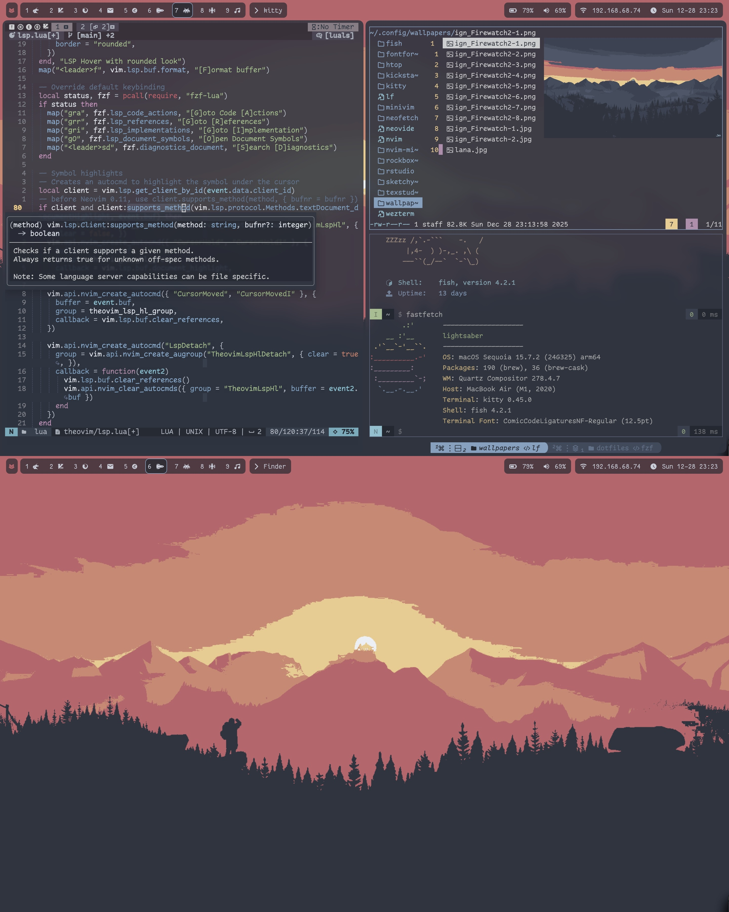

# Theo's dotfiles

|  |
|:--:|
| `wittgenstein` (Framework 13, NixOS, Niri) |
|  |
| `lightsaber` (old M1 Macbook Air, Aerospace) |

> [!NOTE]
> I've recently moved to Nix (NixOS, nix-darwin, home-manager, and Nixvim) and ported my configs over to my [Nix conf repository](https://github.com/theopn/nix-conf).
>
> I will still continue to sync major updates back to this repository!

These are dotfiles for my Linux (Fedora) and macOS systems.
The tools in this repository are primarily open-source utilities for development.

> [!IMPORTANT]
> **Read the code before using them!**

## Installation

### Generating SSH Key for GitHub Authentication

If you are not me, skip this section and use HTTPS cloning.

```sh
# Change the hostname
# macOS:
HOSTNAME=<my computer>; sudo scutil --set ComputerName "$HOSTNAME" && sudo scutil --set HostName "$HOSTNAME"
# Linux:
hostnamectl set-hostname --static <my computer>

ssh-keygen -t ed25519 -C "Theo's ED25519 key @ $(hostname) for GitHub Auth"
# Followed by RET to accept the default path + passphrase
# Add the public key to GitHub Settings -> SSH and GPG Keys
cat ~/.ssh/id_ed25519.pub

# Linux: my Fish config automatically launches keychain and ssh-agent
# macOS: execute the following commands
eval "$(ssh-agent -s)"
ssh-add --apple-use-keychain ~/.ssh/id_ed25519
# Did you know that the Heredoc End-of-Transmission delimiter could be anything?
# Double quote means no parameter expansion
cat <<"HI" >> ~/.ssh/config
Host github.com
    IdentityFile ~/.ssh/id_ed25519
    AddKeysToAgent yes
    UseKeychain yes
HI
```

### Cloning & Deploying Dotfiles - macOS

```sh
# Install dev tools (including Git)
xcode-select --install
/bin/bash -c "$(curl -fsSL https://raw.githubusercontent.com/Homebrew/install/HEAD/install.sh)"
brew analytics off

cd $HOME
git clone git@github.com:theopn/dotfiles.git
cd $HOME/dotfiles

# Install formulae
brew bundle --file ./homebrew/Brewfile_core
brew bundle --file ./homebrew/Brewfile_optional
# Install Nerd Fonts
brew install --cask font-fantasque-sans-mono-nerd-font font-proggy-clean-tt-nerd-font

# Deploy dotfiles using Stow
./bootstrap.sh

# macOS settings
./misc/macos-settings.sh
```

### Cloning & Deploying Dotfiles - Fedora

```sh
# Install packages
sudo dnf upgrade
# TODO: Make a DNF installation script
sudo dnf install git keychain python3-pip stow vim zsh

cd $HOME
git clone git@github.com:theopn/dotfiles.git
cd $HOME/dotfiles

# Move Fedora default bashrc
mv ~/.bashrc ~/.bashrc-fedora

# Deploy dotfiles using Stow
./bootstrap.sh

# Install fonts with font-cache
mkdir -p ~/.local/share/fonts && cd ~/.local/share/fonts/
# TODO: Check that this link is up-to-date before you proceed
wget -O tmp.zip https://github.com/ryanoasis/nerd-fonts/releases/download/v3.4.0/FantasqueSansMono.zip
unzip tmp.zip && rm tmp.zip
# -v: verbose
# -f: force generation
# -r: erase existing cache
fc-cache -vfr
cd -
```

### Post-installation

Now is a good time to reopen the shell.

```sh
# Fish writes universal variables to `$XDG_CONFIG_HOME/fish/fish_variables` for performance
# I created a script to set global variables only once
fish ~/dotfiles/fish/.config/fish/set-universal.fish

# Create and add directories to the directory bookmark/favorites list for my `cdf` fish/zsh function
mkdir -p $XDG_DATA_HOME/theoshell && touch $XDG_DATA_HOME/theoshell/cd-fav.txt
cat <<AHH >> $XDG_DATA_HOME/theoshell/cd-fav.txt
$XDG_CONFIG_HOME
$XDG_DATA_HOME
AHH

# Neovim Treesitter and LSP servers
nvim -c "TSInstall bash c cpp fish html java javascript latex lua luadoc markdown markdown_inline python sql vim vimdoc"
nvim -c "MasonInstall bash-language-server clangd lua-language-server python-lsp-server texlab"

# Generate and copy public SSH key to my school's remote server
ssh-keygen -t rsa -b 4096 -C "Theo's RSA Key @ $(hostname) for Purdue CS servers auth"
ssh-copy-id -i ~/.ssh/id_rsa.pub $(whoami)@data.cs.purdue.edu

# Add SSH alias
# Skip the last two lines in Linux (my Fish config handles launching Keychain and ssh-agent)
cat <<BYE >> ~/.ssh/config
Host data
    Hostname data.cs.purdue.edu
    User $(whoami)
    IdentityFile ~/.ssh/id_rsa
    AddKeysToAgent yes
    UseKeychain yes
BYE
```

Linux systems: install Sway and/or Niri and follow the instructions in the [Haunted Tiles repository](https://github.com/theopn/haunted-tiles).

-----

## Utilities

### Shells

- Bash: Basic configuration for my school SSH server
- ZSH: My login shell (features: Vim mode, handmade prompt with Git info, basic `trash` command mimicking `trash-cli`, and a minimal plugin manager for [zsh-autocompletion](https://github.com/marlonrichert/zsh-autocomplete))
- **Fish**: Main interactive shell (features: multicd (`...` = `cd ../..`), directory bookmarks (`cdf_add` to save, `cdf` to fuzzy-find, `cdf_edit` to modify), and all features from ZSH)
### Terminal emulators and multiplexers

- **Wezterm**: My favorite terminal emulator. See [my YouTube video](https://youtu.be/I3ipo8NxsjY) :) (note that bindings have since been updated to match tmux)
    - Leader: `Ctrl + a`
    - General: `[` (copy mode), `:` (command palette) `s` (workspace picker)
    - Tabs (windows in Tmux): `c` (new), `p/n` (prev/next), `1-9` (go to index), `,` (rename), `.` (`move_tab` mode), `w` (picker)
    - Panes: `%/"` (split vertically/horizontally), `hjkl` (navigate), `SPC` (zoom), `x` (close), `!` (break to tab), `r` (`resize_pane` mode via `<>-+`)
    - Run `wezterm show-keys --lua` for the full list of bindings.
- Kitty: My secondary terminal, though its speed and Neovim scrollback pager are slowly winning me over
  - Leader: `Ctrl + a`
  - Scrollback: `[` (open history in Neovim), `]` (last command output)
  - Windows (panes in Tmux): `enter` (new), `x` (close), `h/j/p` (prev), `k/l/n` (next), `H/J/P` (swap prev), `K/L/N` (swap next), `T` (make master), `r` (resize), `q/Q` (show numbers / show numbers to swap)
  - Tabs (windows in Tmux): `c` (new), `,` (set title), `1-9` (go to index)
  - Layouts: `o/O` (cycle / reverse cycle layouts), `z` (toggle stack/fullscreen)
  - Reference the config file for more details.
- Tmux: mostly for remote environments
  - Prefix: `Ctrl + a` (use `PFX + C-a` to send literal `C-a`)
  - General: `C-r` (reload config), `C-s` (send pane to window)
  - Windows & Panes: `c` (new window), `%` / `"` (split V/H)
  - Navigation: `hjkl` (navigate panes)
  - Copy Mode: Vi-mode enabled (`y` to yank selection)
  - Help: `PFX + ?` (list all keys) or `PFX + / + <key>` (describe key)

### Text editors:

- **Neovim**: My life-long software engineering project. Read [`:h theovim`](./nvim/.config/nvim/doc/theovim.txt), for the ~~700~~ 1080-line help documentation I wrote on my config and Vim tips I have accumulated over the years
    - Read [Neovim related posts](https://theopark.me/tags/neovim/) in my blog!
- Neovide: Neovim GUI frontend with pretty animations
- Vim: a simple config with no plugins, serving as the fallback editor when Neovim fails (which never happened before).
    Features:
    - [40-line Vimscript bufferline](https://theopark.me/blog/2023-03-17-vimscript-bufferline/)
    - ["Bufferpanel"](https://theopark.me/blog/2025-06-01-tabpanel/)
    - based on [Kickstart.vim](https://github.com/theopn/kickstart.vim)

### Others

- **LF**: Simple and fast terminal file manager.
    (Custom preview requires `bat`, Poppler, and either [Sixel](https://www.arewesixelyet.com/) + `chafa` or Kitty `icat`).
    - Use `C-l` to redraw screen if it breaks
    - File (`m` prefix): `mf` (create & edit), `md` (mkdir), `mo` (chmod)
    - Delete (`D` prefix): `DD` (move file(s) to `$XDG_DATA_HOME/theoshell/trash`)
    - Edit (`e` prefix): `ee` (open in `$EDITOR`), `ec` (choose editor)
    - Marks (`m` prefix): `ms` / `ml` / `mr` (save / load / remove mark)
    - Git (`g` prefix): `gs` (git status)
- Git: Some Git settings and global `.gitignore` file
- Fastfetch: essential

## macOS

### macOS Tiling WM Setup

> [!NOTE]
> I no longer use Sketchybar, but the config works just fine.
> Please reference the [archive readme](./archive/README.md) for more information.

My Aerospace configuration mostly default config.

> [!NOTE]
> `MOD + d` is a temporary [workaround](https://github.com/nikitabobko/AeroSpace/discussions/1371) for window picking.

- Modifier : `alt/opt/⌥`
- General: `Enter` (open Wezterm), `d` (terminal window picker)
- Windows: `hjkl` (focus), `Shift + hjkl` (move), `-/=` (resize)
- Layouts: `e/w` (toggle H/V tiling / accordion), `Shift + Space` (toggle floating/tiling)
- Workspaces: `1-9` (go to), `Shift + 1-9` (move tree to), `Tab` (prev workspace), `Shift + Tab` (move workspace to monitor)
- Service Mode (`MOD + Shift + ;`): `Esc` (reload config & exit), `r` (reset layout & exit), `Shift + hjkl` (join windows to trees)

### Homebrew

> [!NOTE]
> **Bolded** items are in `Brewfile_core`, other items are in `Brewfile_optional`

Formulae:

- System tools: **btop**, **eza**, **fastfetch**, **fish**, openconnect, **stow**, **tmux**, **tree**, **wget**
- media: exiftool, **ffmpeg**, figlet, **imagemagick**
- Development: **git-filter-repo**, **hugo**, **node**, **python**, qemu, r, **rust**
- lf: **bat**, chafa, **lf**, **poppler**
- Neovim: **fd**, **neovim**, **ripgrep**, **tree-sitter-cli**

Casks:

- Development: Docker, IntelliJ CE, KiCad, Kitty, MacTex (no GUI), **Macvim**, Neovide, RStudio, **Wezterm**
- Fun & Media: GIMP, Minecraft, OBS, Spotify, VLC
- Productivity: **Itsycal**, Notion, Zotero
- Sync: Cryptomator, Filen, Nextcloud, Syncthing
- System: **Aerospace**, **Ice**, **Maccy**, **Stats**
- Tools: **Bitwarden**, CEmu, KeyCastr, **Skim**
- Web: Discord, **Firefox**, Tailscale, Thunderbird, Ungoogled Chromium


### macOS Settings

`./misc/macos-settings.sh` includes some macOS settings like adding a Dock spacer, show hidden files in Finder, changing screenshot format and location, etc.

## Archive

> [!WARNING]
> Configuration files in the archive directory are no longer maintained

See the [list of archived configurations](./archive/README.md).

## Inspirations and Shameless Plug

- Font(s): I use [Comic Code](https://tosche.net/fonts/comic-code) (yes, [I paid $30 for the monospaced Comic Sans](http://theopark.me/blog/2025-12-27-comic-code/)), [Fantasque Sans](https://github.com/belluzj/fantasque-sans), and [Ubuntu Sans Mono](https://github.com/canonical/Ubuntu-Sans-Mono-fonts); all [Nerd Font](https://www.nerdfonts.com/) patched
- macOS wallpaper: "Firewatch 2" in [nordic-wallpapers](https://github.com/linuxdotexe/nordic-wallpapers)
- Aerospace: [`default-config.toml`](https://nikitabobko.github.io/AeroSpace/guide.html#default-config) and [DevOps Toolbox's Dotfiles](https://github.com/omerxx/dotfiles)
- LF: [example `lfrc`](https://github.com/gokcehan/lf/tree/master/etc), [Brodie Robertson's Dotfiles](https://github.com/BrodieRobertson/dotfiles/blob/master/config/lf/lfrc), and [`lfimg` for `batorcat` function](https://github.com/thimc/lfimg/blob/master/preview)
- Neovim: Spiritual successor of [Theovim](https://github.com/theopn/theovim)
    - Theovim logo and my shell startup function cats are ASCII art of [my cat Oliver](https://theopark.me/blog/2025-11-06-framework/), many of which are taken from [ASCII Art Archive](https://www.asciiart.eu/animals/cats) or made with a help of my friend [Jonathan](https://github.com/JonathanOppenheimer)
        ```
            \/       \/
            /\_______/\
           /   o   o   \
          (  ==  ^  ==  )
           )  [Ollie]  (
          (             )
          ( (  )   (  ) )
         (__(__)___(__)__)
        ___
         | |_  _  _     o __
         | | |(/_(_)\_/ | |||
        ```
- Sketchybar: [default plugins](https://github.com/FelixKratz/SketchyBar/tree/master/plugins)
- Vim: [kickstart.vim](https://github.com/theopn/kickstart.vim)
- Wezterm: [my Wezterm config video](https://www.youtube.com/watch?v=I3ipo8NxsjY)
- [Haunted Tiles](https://github.com/theopn/haunted-tiles/) has dotfiles for my minimal, Dracula-themed i3/Sway environment.

